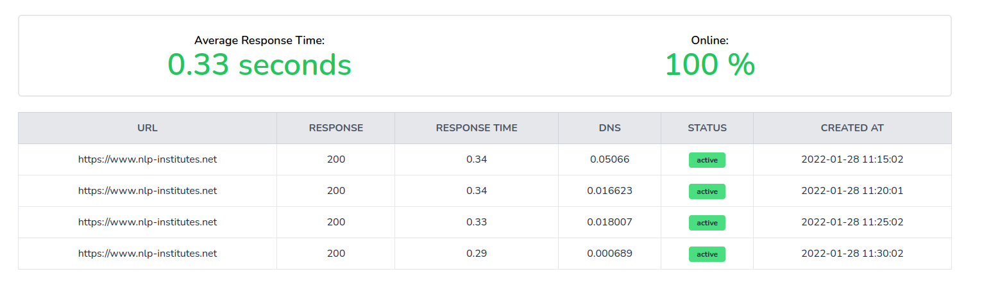

# A simple Laravel monitor application

An application to check if your domain is online and the average response time



## Installation

Clone repository and copy  `.env.example` to `.env` 
Add your database credentials to `.env` (you can also use SQLite setting).
Next add the url to inspect as value in `.env` file for key `MONITOR_URL`

Then run your application using 

``` 
composer install --optimize-autoloader --no-dev
php artisan storage:link
php artisan key:generate
php artisan migrate
``` 

Finally, you have to setup a [cronjob](https://laravel.com/docs/scheduling#running-the-scheduler) to run every minute

``` 
* * * * * cd /path-to-your-project && php artisan schedule:run >> /dev/null 2>&1
``` 

Also make sure that your hoster points to the `public` directory.

You can now access the website.
